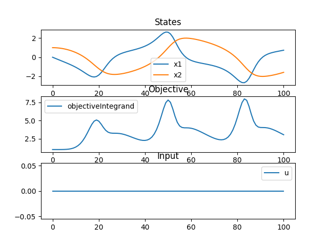
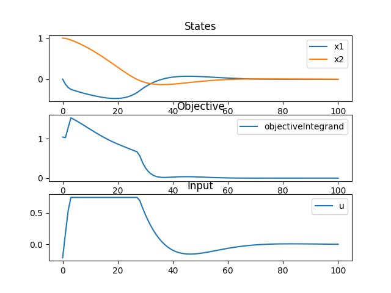

# optimo
Optimization of Modelica models.

`optimo` uses [OpenModelica](https://openmodelica.org/) for compilation of Modelica models into FMUs. It then relies on [CasADi](https://web.casadi.org/) and [Rockit](https://gitlab.kuleuven.be/meco-software/rockit) to simulate and optimize from those models in Python. 

## Example
We first define our Modelica model in a `.mo` script.

```Modelica
model vdp
  "Van der Pol oscillator model."
  
  Real x1(start=0) "The first state";  
  Real x2(start=1) "The second state"; 
  input Real u(start=0) "The control signal"; 
  output Real objectiveIntegrand(start=0) "The objective signal"; 

equation
  der(x1) = (1 - x2^2) * x1 - x2 + u; 
  der(x2) = x1; 
  objectiveIntegrand = x1^2 + x2^2 + u^2;

end vdp;
```

Now we use this model for simulation and optimization in a Python script:


```Python
import matplotlib.pyplot as plt
from optimo.model import OptimoModel

# Compile and transfer the Modelica model
mo = OptimoModel()
mo.transfer_model(model="vdp")

# Simulate
res_sim_df = mo.simulate()

# Optimize 
mo.define_optimization(constraints={"u":(-1, 0.75)}, 
                       objective_terms=["objectiveIntegrand"])
res_ocp_df = mo.optimize()

```

If no input trajectories are provided, the simulation runs with the initial input values as defined in the model. 
When plotting these results (see [full example](examples/vdp.py)) we obtain the following graphs:

### Simulation results


### Optimization results
